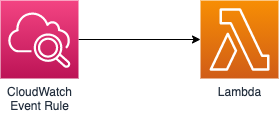

# PHP daily

PHP daily is a daily function, piece of news, library or just a tip. 

To post daily updates it uses AWS Lambda on a Python which is triggered by the CloudWatch event rule: 

### Folders structure

- [src](./src): lambda function code and packages
- [infrastructure](./infrastructure): terraform code to deploy function and its infrastructure 

### Q&A

**How much does it costs?** Near 2 cents per 1 month.

**Why python?** Because AWS doesn't have native support of PHP and it's just fun.

**Why event rule is triggered every 23 hours?** Not to be stuck in one timezone. 

## Also

Feel free to add comments, issues, pull requests or just follow this twitter:  
[https://twitter.com/phpdaily_](https://twitter.com/phpdaily_)
